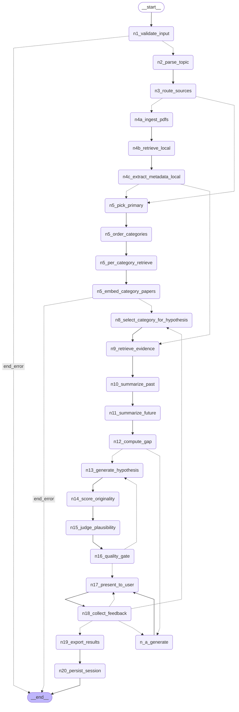

# Neurohypothesis v2.1 — graph topology

Generated: 2026-06-06 17:50:14

This Mermaid diagram is auto-generated by `build_graph()` at app startup.  GitHub / VS Code / many Markdown viewers render it directly; otherwise paste the contents of the code block below into https://mermaid.live to view interactively.

